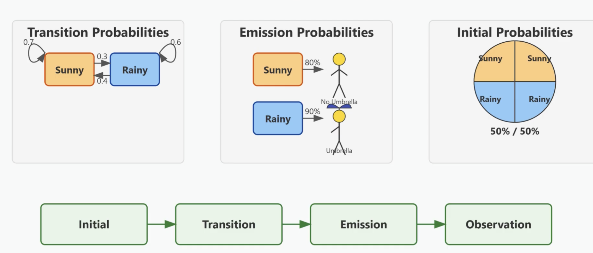
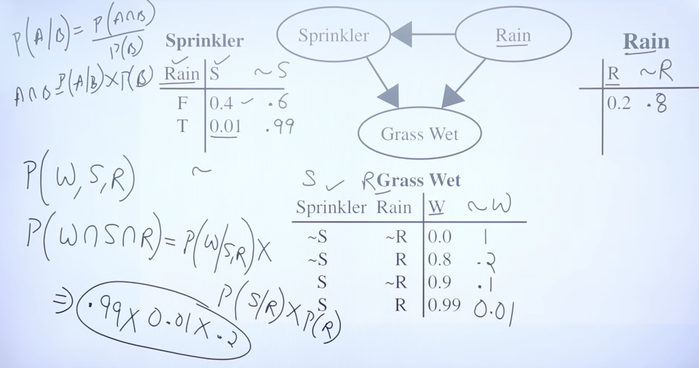

# 2. Knowledge Representation and Reasoning

# 2.1 First-Order Logic (FOL) and Reasoning

> **What is Knowledge? How can we represent it? Discuss about the Properties of a Good Knowledge Representation System. (7) (Fall 2025)**
>
> **What are the advantages of First-Order Logic over Propositional Logic? Suppose a KB contains the following premises: A ∨ B, A ⟹ C and ¬B. Now, prove C using resolution method. (7) (Spring 2025)**
>
> **Does "If you are qualified, you will get the job" and "If you did not get the job, you were not qualified" say the same thing? Answer using a truth-table approach. (7) (Internal 2025)**

## Knowledge and Knowledge Representation

**Knowledge** is the awareness or understanding of facts, concepts, relationships, and procedures acquired through experience, observation, or learning. In AI, knowledge refers to information that an agent uses to reason and make decisions.

**Knowledge Representation (KR)** is the method by which knowledge about the real world is encoded into a form that a computer system can use for reasoning and problem-solving. The goal is to enable an intelligent agent to store, retrieve, and manipulate knowledge to derive new conclusions.

**Properties of a Good Knowledge Representation System:**

1. **Representational Adequacy:** The ability to represent all kinds of knowledge required in the domain — facts, rules, relationships, and constraints.
2. **Inferential Adequacy:** The ability to manipulate representational structures to derive new knowledge from existing knowledge through logical inference.
3. **Inferential Efficiency:** The ability to incorporate additional mechanisms (heuristics, control strategies) to direct the inference process and derive conclusions in a reasonable time.
4. **Acquisitional Efficiency:** The ability to acquire new knowledge easily, either from human experts, sensors, or through automated learning, without restructuring the entire system.

## Propositional Logic (Recap)

Propositional logic deals with propositions (statements that are either true or false) and logical connectives. Each proposition is represented by a symbol (P, Q, R, ...).

**Logical Connectives:** ¬ (NOT), ∧ (AND), ∨ (OR), → (implication), ↔ (biconditional).

**Truth-table approach — Are the two statements equivalent?**

Company A: "If you are qualified, you will get the job" → P → Q
Company B: "If you did not get the job, you were not qualified" → ¬Q → ¬P

The second statement is the **contrapositive** of the first. By the law of contraposition: P → Q ≡ ¬Q → ¬P.

| P   | Q   | P → Q | ¬Q  | ¬P  | ¬Q → ¬P |
| --- | --- | ----- | --- | --- | ------- |
| T   | T   | T     | F   | F   | T       |
| T   | F   | F     | T   | F   | F       |
| F   | T   | T     | F   | T   | T       |
| F   | F   | T     | T   | T   | T       |

Since P → Q and ¬Q → ¬P have identical truth values in every row, **both statements are logically equivalent**.

**Limitations of Propositional Logic:** It cannot represent objects, properties, or relations between objects. It lacks variables and quantifiers, so every individual fact needs a separate proposition. For example, to say "All humans are mortal," propositional logic requires a separate statement for every human, making it impractical for complex domains.

## First-Order Logic (FOL)

First-Order Logic (also called Predicate Logic) extends propositional logic by introducing **objects**, **predicates** (properties and relations), **functions**, and **quantifiers**. It is far more expressive and can compactly represent general knowledge.

**Components of FOL:**

- **Constants:** Refer to specific objects (e.g., John, 5, Nepal).
- **Variables:** Stand for any object in the domain (e.g., x, y).
- **Predicates:** Represent properties or relations (e.g., Human(x), Brother(x, y)).
- **Functions:** Map objects to objects (e.g., Father(x) returns the father of x).
- **Connectives:** Same as propositional logic — ¬, ∧, ∨, →, ↔.
- **Quantifiers:**
  - **Universal Quantifier (∀):** "For all" — ∀x Human(x) → Mortal(x) means "All humans are mortal."
  - **Existential Quantifier (∃):** "There exists" — ∃x Human(x) ∧ Smart(x) means "There exists a human who is smart."

**Advantages of FOL over Propositional Logic:**

- Can represent relationships between objects, not just isolated facts.
- Uses variables and quantifiers to write general rules compactly.
- Supports functions for expressing complex relationships.
- More natural for representing real-world knowledge.

## Inference in FOL

**Key Inference Rules:**

- **Modus Ponens:** From P and P → Q, infer Q.
- **Universal Instantiation:** From ∀x P(x), infer P(c) for any constant c.
- **Existential Instantiation:** From ∃x P(x), infer P(k) for a new constant k (Skolem constant).
- **Unification:** The process of finding a substitution that makes two logical expressions identical. For example, unifying Knows(John, x) with Knows(John, Jane) gives {x/Jane}.

**Forward Chaining:** Starts from known facts, applies inference rules to derive new facts until the query is answered or no new facts can be derived. Data-driven approach.

**Backward Chaining:** Starts from the query (goal), works backward to find supporting facts and rules. Goal-driven approach. Used in Prolog.

**Resolution:** A single inference rule that is complete for FOL. It works by proof by contradiction (refutation). All sentences are converted to Conjunctive Normal Form (CNF), the negation of the goal is added, and resolution is applied until the empty clause (contradiction) is derived.

**Example — Prove C from: A ∨ B, A ⟹ C, ¬B using Resolution:**

Step 1: Convert to CNF.

- Clause 1: A ∨ B
- Clause 2: ¬A ∨ C (from A → C)
- Clause 3: ¬B

Step 2: Add negation of goal. Clause 4: ¬C

Step 3: Resolve.

- Resolve Clause 2 (¬A ∨ C) with Clause 4 (¬C) → Clause 5: ¬A
- Resolve Clause 1 (A ∨ B) with Clause 5 (¬A) → Clause 6: B
- Resolve Clause 6 (B) with Clause 3 (¬B) → **Empty clause (∅)**

Since the empty clause is derived, the assumption ¬C is inconsistent with the premises. Therefore, **C is proven**.

## Rules

<!-- - **Quantifier Negation (De Morgan's Laws for Quantifiers):**
- $\neg (\forall x \, P(x)) \equiv \exists x \, \neg P(x)$
- $\neg (\exists x \, P(x)) \equiv \forall x \, \neg P(x)$

- **Quantifier Distribution:**
- $\forall x (P(x) \land Q(x)) \equiv (\forall x \, P(x)) \land (\forall x \, Q(x))$
- $\exists x (P(x) \lor Q(x)) \equiv (\exists x \, P(x)) \lor (\exists x \, Q(x))$ -->
<!-- - $\forall x (P(x) \lor Q(x)) \not\equiv (\forall x \, P(x)) \lor (\forall x \, Q(x))$ _(Implication holds left to right only)_
- $\exists x (P(x) \land Q(x)) \not\equiv (\exists x \, P(x)) \land (\exists x \, Q(x))$ _(Implication holds right to left only)_ -->

<!-- - **Scope Extension (where $A$ contains no free occurrences of $x$):**
- $\forall x (P(x) \lor A) \equiv (\forall x \, P(x)) \lor A$
- $\exists x (P(x) \land A) \equiv (\exists x \, P(x)) \land A$ -->
<!-- - $\forall x (A \rightarrow P(x)) \equiv A \rightarrow (\forall x \, P(x))$
- $\exists x (A \rightarrow P(x)) \equiv A \rightarrow (\exists x \, P(x))$
- $\forall x (P(x) \rightarrow A) \equiv (\exists x \, P(x)) \rightarrow A$
- $\exists x (P(x) \rightarrow A) \equiv (\forall x \, P(x)) \rightarrow A$ -->

<!-- --- -->

**Quantifier Rules of Inference**

| Rule Name                           | Premise             | Conclusion          | Arbitrary / Specific Constraint                          |
| ----------------------------------- | ------------------- | ------------------- | -------------------------------------------------------- |
| **Universal Instantiation (UI)**    | $\forall x \, P(x)$ | $P(c)$              | $c$ can be _any_ arbitrary or specific element in domain |
| **Universal Generalization (UG)**   | $P(c)$              | $\forall x \, P(x)$ | $c$ MUST be an _arbitrary_ element (not specific)        |
| **Existential Instantiation (EI)**  | $\exists x \, P(x)$ | $P(c)$              | $c$ MUST be a _new, specific_ element not used prior     |
| **Existential Generalization (EG)** | $P(c)$              | $\exists x \, P(x)$ | $c$ is a _known element_ in the domain                   |

---

**Propositional Rules of Inference**

| Rule Name                  | Formula / Structure                                           |
| -------------------------- | ------------------------------------------------------------- |
| **Modus Ponens**           | $P, P \rightarrow Q \;\vdash\; Q$                             |
| **Modus Tollens**          | $\neg Q, P \rightarrow Q \;\vdash\; \neg P$                   |
| **Hypothetical Syllogism** | $P \rightarrow Q, Q \rightarrow R \;\vdash\; P \rightarrow R$ |
| **Disjunctive Syllogism**  | $P \lor Q, \neg P \;\vdash\; Q$                               |
| **Addition**               | $P \;\vdash\; P \lor Q$                                       |
| **Simplification**         | $P \land Q \;\vdash\; P$                                      |
| **Conjunction**            | $P, Q \;\vdash\; P \land Q$                                   |
| **Resolution**             | $P \lor Q, \neg P \lor R \;\vdash\; Q \lor R$                 |

---

**Core Propositional Equivalences**

- **Material Implication:** $P \rightarrow Q \equiv \neg P \lor Q$
- **Biconditional Expansion:** $P \leftrightarrow Q \equiv (P \rightarrow Q) \land (Q \rightarrow P) \equiv (P \land Q) \lor (\neg P \land \neg Q)$
- **Contraposition:** $P \rightarrow Q \equiv \neg Q \rightarrow \neg P$
- **De Morgan's Laws:**
- $\neg (P \land Q) \equiv \neg P \lor \neg Q$
- $\neg (P \lor Q) \equiv \neg P \land \neg Q$

---

# 2.2 Probabilistic Reasoning

> **What are Hidden Markov Models (HMMs)? Explain their structure and how they are used for probabilistic reasoning over time with a suitable example. (8) (Fall 2025)**

Many real-world environments are **dynamic** and **uncertain** — the state of the world changes over time, and the agent cannot observe it perfectly. Probabilistic reasoning over time addresses this by modeling how the world evolves and how observations relate to hidden states.

**Key Assumptions:**

- **Markov Assumption (First-Order):** The current state depends only on the immediately previous state, not on the entire history. $P(X_t \mid X_{0:t-1}) = P(X_t \mid X_{t-1})$.
- **Stationary Process:** The transition and observation models do not change over time.

**Two fundamental models define a temporal probabilistic system:**

1. **Transition Model:** $P(X_t \mid X_{t-1})$ — how the state evolves from one time step to the next.
2. **Sensor (Observation) Model:** $P(E_t \mid X_t)$ — the probability of an observation given the current hidden state.

**Inference Tasks:**

- **Filtering:** Compute $P(X_t \mid e_{1:t})$ — the belief state at current time given all evidence so far. This is what an agent needs for decision-making.
- **Prediction:** Compute $P(X_{t+k} \mid e_{1:t})$ — estimate future states given current evidence.
- **Smoothing:** Compute $P(X_k \mid e_{1:t})$ for $0 \leq k < t$ — revise past estimates given later evidence. More accurate than filtering.
- **Most Likely Explanation:** Find the sequence of states that best explains the observations (Viterbi algorithm).

## 2.2.1 Hidden Markov Models (HMMs)

An HMM is a temporal probabilistic model where the system is assumed to be a Markov process with **hidden (unobservable) states** that produce **observable outputs**. It is a special case of a Dynamic Bayesian Network with a single discrete state variable.

**Structure of an HMM:**

- **States (S):** A finite set of hidden states $\{s_1, s_2, \ldots, s_N\}$.
- **Observations (O):** A finite set of observable symbols $\{o_1, o_2, \ldots, o_M\}$.
- **Transition Probability Matrix (A):** $a_{ij} = P(X_t = s_j \mid X_{t-1} = s_i)$ — probability of moving from state $i$ to state $j$.
- **Observation/Emission Probability Matrix (B):** $b_j(o_k) = P(E_t = o_k \mid X_t = s_j)$ — probability of observing $o_k$ when in state $s_j$.
- **Initial State Distribution (π):** $\pi_i = P(X_1 = s_i)$ — probability of starting in state $i$.

An HMM is fully specified by $\lambda = (A, B, \pi)$.



<!-- **Three Fundamental Problems of HMMs:**

1. **Evaluation (Likelihood):** Given a model $\lambda$ and an observation sequence, compute $P(O \mid \lambda)$. Solved by the **Forward Algorithm**.
2. **Decoding:** Given a model $\lambda$ and an observation sequence, find the most likely state sequence. Solved by the **Viterbi Algorithm**.
3. **Learning:** Given observation sequences, find the model parameters $\lambda$ that maximize $P(O \mid \lambda)$. Solved by the **Baum-Welch Algorithm** (a special case of EM). -->

**Example:** A doctor cannot directly observe whether a patient is Healthy or has a Fever (hidden states). The doctor observes the patient's activities: Normal, Cold, Dizzy (observations). The transition matrix defines probabilities like $P(\text{Fever today} \mid \text{Healthy yesterday}) = 0.3$. The emission matrix defines $P(\text{Dizzy} \mid \text{Fever}) = 0.5$. Given a sequence of observations over several days, the HMM can infer the most likely sequence of health states.

**Applications:** Speech recognition, POS tagging in NLP, gene sequence analysis, gesture recognition, weather prediction.

## 2.2.2 Dynamic Bayesian Networks (DBNs)

A Dynamic Bayesian Network is a generalization of HMMs that represents the state of the world using a **set of random variables** rather than a single variable. Each time slice contains multiple state variables and observation variables, connected by a Bayesian network structure.

**Structure:**

- Each time slice $t$ has a set of state variables $X_t = \{X_t^1, X_t^2, \ldots, X_t^n\}$ and evidence variables $E_t$.
- **Intra-slice connections:** Represent dependencies among variables within the same time step.
- **Inter-slice connections:** Represent how variables at time $t$ depend on variables at time $t-1$ (the transition model).
- The network is defined by the structure and CPTs (Conditional Probability Tables) of just **two time slices** — this is then "unrolled" for as many time steps as needed.

**Relationship to HMMs:** An HMM is a DBN with a single state variable. A DBN is more general — it can factorize the state space into multiple variables, exploiting conditional independence to reduce the number of parameters exponentially.

**Example:** A vehicle monitoring system. State variables at each time step: $\text{Battery}_t$, $\text{Fuel}_t$, $\text{Engine}_t$. Observations: $\text{Gauge}_t$, $\text{StarterMotor}_t$. The DBN captures that $\text{Battery}_t$ depends on $\text{Battery}_{t-1}$ and $\text{Fuel}_t$ depends on $\text{Fuel}_{t-1}$, while $\text{Engine}_t$ depends on both $\text{Battery}_t$ and $\text{Fuel}_t$ within the same slice.

**Inference in DBNs:** Exact inference can be done by unrolling the network and applying standard Bayesian network inference (variable elimination, junction tree). However, this becomes intractable for long sequences. **Approximate methods** like particle filtering (sequential Monte Carlo) are commonly used.



---

# 2.3 Ontological Engineering

> **What is ontology engineering? Explain the stages in ontology development life cycle. (8) (Spring 2025)**

**Ontological engineering** is the process of defining a general framework of concepts — an **upper ontology** — that provides a shared vocabulary for representing knowledge about the world. Unlike narrow, domain-specific knowledge engineering, ontological engineering aims to create broad, reusable representations of general concepts such as time, space, events, objects, and categories.

**Purpose:** When building AI systems for complex domains, instead of creating knowledge representations from scratch each time, an ontology provides a standard set of concepts and relationships that can be reused and extended across domains.

**General Concepts in an Upper Ontology:**

- **Categories and Objects:** The world is organized into categories (e.g., Animals, Vehicles). Objects are instances of categories. Categories can be organized into hierarchies (taxonomies) with inheritance of properties.
- **Events and Processes:** Represent actions and changes over time using event calculus or situation calculus.
- **Time and Space:** Represent temporal intervals, spatial locations, and their relationships.
- **Physical and Abstract Objects:** Distinguish between tangible entities and abstract concepts like numbers, beliefs, or plans.
- **Substances and Quantities:** Represent stuff (water, gold) vs. individual objects, along with measurable quantities (mass, temperature).

**Stages in the Ontology Development Life Cycle:**

1. **Specification:** Define the purpose, scope, and intended users of the ontology. Determine what competency questions the ontology should answer.
2. **Conceptualization:** Identify the key concepts, relationships, and constraints in the domain. Create an informal model (glossary of terms, concept maps).
3. **Formalization:** Translate the conceptual model into a formal representation using a knowledge representation language (e.g., OWL — Web Ontology Language, Description Logic).
4. **Implementation:** Encode the formalized ontology in a machine-readable format using ontology tools (e.g., Protégé).
5. **Evaluation:** Verify and validate the ontology — check for logical consistency, completeness, and whether it satisfies the competency questions.
6. **Maintenance:** Update the ontology as the domain evolves — add new concepts, refine relationships, and remove obsolete elements.

Throughout the life cycle, **documentation** and **knowledge acquisition** (gathering domain expertise from experts, textbooks, existing databases) are ongoing activities.

---

# 2.4 Semantic Networks

Semantic networks are a graphical approach to knowledge representation where knowledge is depicted as a **directed graph**. **Nodes** represent concepts or objects, and **edges** (links) represent relationships between them.

**Common Relationship Types:**

- **IS-A (subclass):** Dog IS-A Animal — represents class hierarchy.
- **Instance-of:** Fido Instance-of Dog — represents membership.
- **Has-part:** Car Has-part Engine — represents composition.
- **Property links:** Bird Has-property Can-fly — represents attributes.

**Inheritance:** Properties are inherited through the IS-A hierarchy. If "Bird Can-fly" and "Sparrow IS-A Bird," then Sparrow inherits the property Can-fly. This supports **default reasoning** — a property is assumed unless explicitly overridden (e.g., Penguin IS-A Bird but has an explicit "Cannot-fly" property).

**Example:**

```
  Animal
    ↑ IS-A
   Bird ——Has-property——→ Can-fly
    ↑ IS-A
  Sparrow ——Has-color——→ Brown
```

Sparrow inherits "Can-fly" from Bird and "Living-thing" properties from Animal.

**Advantages:** Intuitive and easy to visualize. Good for organizing taxonomic knowledge. Support inheritance for efficient knowledge storage.

**Limitations:** Lack formal semantics — the meaning of links can be ambiguous. Cannot easily represent disjunction, negation, or quantified statements. No standardized inference procedures. These limitations motivated the development of **Description Logic**.

---

# 2.5 Description Logic

> **Define descriptive logic. Explain the components of descriptive logic in detail. (8) (Internal 2025)**

**Description Logic (DL)** is a family of formal knowledge representation languages that provides a logical foundation for semantic networks and ontologies. It is designed to represent structured knowledge about concepts (classes), roles (relationships), and individuals in a domain, with well-defined semantics and decidable inference procedures.

Description Logic underlies the **Web Ontology Language (OWL)**, the standard for representing ontologies on the Semantic Web.

**Components of Description Logic:**

**1. Concepts (Classes):** Represent sets of individuals. Atomic concepts are named classes (e.g., Person, Animal). Complex concepts are built using constructors:

- **Intersection (⊓):** Person ⊓ Female — individuals that are both persons and female.
- **Union (⊔):** Doctor ⊔ Lawyer — individuals that are doctors or lawyers.
- **Negation (¬):** ¬Male — individuals that are not male.
- **Existential Restriction (∃):** ∃hasChild.Female — individuals that have at least one child who is female.
- **Universal Restriction (∀):** ∀hasChild.Doctor — individuals all of whose children are doctors.
- **Number Restrictions (≥n, ≤n):** ≥2 hasChild — individuals with at least 2 children.

**2. Roles (Relations):** Represent binary relationships between individuals (e.g., hasChild, worksFor, teaches). Roles can have properties:

- **Inverse roles:** If hasChild relates parent to child, then hasParent is its inverse.
- **Transitive roles:** ancestorOf is transitive — if A is ancestor of B and B is ancestor of C, then A is ancestor of C.

**3. Individuals:** Specific objects in the domain (e.g., John, MIT, Nepal).

**Knowledge Base in DL has two components:**

- **TBox (Terminological Box):** Contains concept definitions and axioms — the schema or vocabulary. Example: Mother ≡ Person ⊓ Female ⊓ ∃hasChild.Person (a mother is a female person who has at least one child who is a person).
- **ABox (Assertional Box):** Contains assertions about specific individuals. Example: Person(John), hasChild(Mary, Tom).

**\*\*Key Reasoning Tasks:**

- **Subsumption:** Is concept C a subset of concept D? (e.g., Is Mother subsumed by Person?)
- **Consistency:** Is the knowledge base free of contradictions?
- **\*\*Classification:** Determine the most specific concept an individual belongs to.
- **Instance Checking:** Does individual a belong to concept C?

**Advantages over Semantic Networks:** Formal semantics, decidable reasoning, support for complex concept construction, and standardized inference algorithms.

---

# 2.6 Fuzzy Logic — Fuzzy Inference Systems

> **Illustrate the Mamdani Fuzzy Inference System with a suitable example. (8) (Internal 2025)**
>
> **A city uses a fuzzy logic-based traffic control system to adjust green light duration depending on traffic density. How can we design a FIS? Explain the role of defuzzification in final decision-making. (8) (Fall 2025)**
>
> **Illustrate the Sugeno Fuzzy Inference System with a suitable example. How does it differ from Mamdani? (7) (Spring 2025)**

Classical (Boolean) logic deals with only two truth values: 0 (false) and 1 (true). **Fuzzy logic** extends this by allowing **partial truth** — a degree of membership between 0 and 1. This is useful for modeling vague, imprecise, or uncertain concepts that are common in human reasoning (e.g., "tall," "warm," "fast").

**Fuzzy Set:** A set where each element has a **degree of membership** $\mu(x) \in [0, 1]$, rather than simply belonging or not. For example, in the fuzzy set "Tall": a person of height 6'2" might have $\mu = 0.9$, while a person of 5'6" might have $\mu = 0.4$.

**Membership Functions:** A membership function is the rule/formula that tells us how much an input belongs to a fuzzy set. Define the degree of membership for each value. Common shapes: triangular, trapezoidal, Gaussian, bell-shaped.

| Height | Membership μ(x) | Meaning             |
| ------ | --------------: | ------------------- |
| 5'2"   |             0.0 | Definitely not tall |
| 5'6"   |             0.4 | Somewhat tall       |
| 5'10"  |             0.7 | Fairly tall         |
| 6'2"   |             0.9 | Very tall           |
| 6'6"   |             1.0 | Definitely tall     |

**Fuzzy Operations:**

- **Union (OR):** $\mu_{A \cup B}(x) = \max(\mu_A(x),\, \mu_B(x))$
- **Intersection (AND):** $\mu_{A \cap B}(x) = \min(\mu_A(x),\, \mu_B(x))$
- **Complement (NOT):** $\mu_{\neg A}(x) = 1 - \mu_A(x)$

## Fuzzy Inference System (FIS)

A Fuzzy Inference System maps crisp inputs to a crisp output using fuzzy logic. It processes inputs through fuzzy rules (IF-THEN rules with fuzzy sets) to produce a decision.

**General Steps of a FIS:**

1. **Fuzzification:** Convert crisp input values into fuzzy membership values using membership functions.
2. **Rule Evaluation:** Apply fuzzy IF-THEN rules. Each rule has an antecedent (IF part) and a consequent (THEN part). The firing strength of each rule is computed using fuzzy AND/OR operations.
3. **Aggregation:** Combine the outputs of all fired rules into a single fuzzy output.
4. **Defuzzification:** Convert the aggregated fuzzy output into a single crisp value.

## 2.6.1 Mamdani Fuzzy Inference System

The Mamdani FIS was created by Ebrahim Mamdani in 1975. It is the most popular type of fuzzy inference system. In this system, both the IF part (input) and the THEN part (output) of every rule use **fuzzy sets** (words like "Low", "High", "Medium", etc.).

**How it works (Steps):**

1. **Fuzzification:** Take the exact input number and find out how much it belongs to each fuzzy group. For example, if traffic = 70 cars, how much is it "High"? How much is it "Medium"?
2. **Rule Evaluation:** Look at each rule and figure out how strongly it fires. If a rule says "A AND B", pick the smaller membership value (min). If it says "A OR B", pick the bigger one (max). Then cut (clip) the output fuzzy shape to match this strength.
3. **Aggregation:** Take all the clipped output shapes from every rule and combine them into one big shape by overlapping them (using max/union).
4. **Defuzzification:** Turn that combined fuzzy shape into one exact number — the final answer.

**Example — Traffic Light Control System:**

Inputs: Traffic_Density (Low, Medium, High), Waiting_Time (Short, Medium, Long).
Output: Green_Duration (Short, Medium, Long).

Membership functions: Triangle-shaped graphs are used for each fuzzy word.

Rules:

- IF Traffic_Density is High AND Waiting_Time is Long THEN Green_Duration is Long.
- IF Traffic_Density is Low AND Waiting_Time is Short THEN Green_Duration is Short.
- IF Traffic_Density is Medium THEN Green_Duration is Medium.

Let's say Traffic*Density = 70 vehicles → it belongs 0.7 to "High" ($\mu*{\text{High}} = 0.7$) and 0.3 to "Medium" ($\mu*{\text{Medium}} = 0.3$). Waiting_Time = 50 sec → it belongs 0.6 to "Long" ($\mu*{\text{Long}} = 0.6$).

Rule 1 says "High AND Long" → pick the smaller value: $\min(0.7, 0.6) = 0.6$. So we clip the "Long" output shape at 0.6.
Rule 3 says "Medium" → strength is 0.3. So we clip the "Medium" output shape at 0.3.

Aggregate: Overlap all the clipped shapes together (take max where they overlap).
Defuzzify: Find the balancing point (centroid) of the combined shape to get the final Green_Duration number.

**Defuzzification Techniques (ways to get the final number):**

- **Centroid (Center of Gravity):** $x^* = \dfrac{\int \mu(x) \cdot x\, dx}{\int \mu(x)\, dx}$ — This is the most common method. It finds the "balancing point" (center of mass) of the combined fuzzy shape. Think of it like finding where you would place your finger to balance a cardboard cutout of that shape.
- **Bisector of Area (BOA):** Find the point that splits the shape into two equal halves by area — like cutting a pizza into two equal pieces with one straight vertical cut.
- **Mean of Maximum (MOM):** Find all the points where the shape is at its tallest, then take their average.
- **Smallest of Maximum (SOM):** Among the points where the shape is tallest, pick the smallest (leftmost) one.
- **Largest of Maximum (LOM):** Among the points where the shape is tallest, pick the largest (rightmost) one.

## 2.6.2 Sugeno Fuzzy Inference System (Takagi-Sugeno-Kang)

The Sugeno FIS is similar to Mamdani in the IF part — it still uses fuzzy sets like "High" or "Low". But the big difference is in the THEN part: instead of using a fuzzy word, it gives an **exact number or a simple math formula**. This number can be a constant (just a fixed value, called zero-order Sugeno) or a simple equation using the inputs (called first-order Sugeno).

**Rule Format:** IF $x$ is $A$ AND $y$ is $B$ THEN $z = f(x, y)$, where $f$ is usually a constant number or a simple formula like $z = ax + by + c$.

**How it works (Steps):**

1. **Fuzzification:** Same as Mamdani — turn exact input numbers into fuzzy membership values.
2. **Rule Evaluation:** Find the firing strength $w_i$ for each rule (how strongly each rule applies), using min or product for AND.
3. **Output Computation:** Each rule directly gives an exact output number $z_i$ using its formula.
4. **Defuzzification:** Calculate the final answer using a **weighted average** — $z^* = \dfrac{\sum w_i \cdot z_i}{\sum w_i}$. This is much simpler than Mamdani because there are no shapes to deal with — just multiply and add numbers.

**Example — Tip Calculation:**

Inputs: Service (Poor, Good, Excellent), Food (Rancid, Delicious).
Output: Tip (percentage).

Rules:

- IF Service is Poor OR Food is Rancid THEN Tip = 5%.
- IF Service is Good THEN Tip = 15%.
- IF Service is Excellent OR Food is Delicious THEN Tip = 25%.

Let's say Service = 7 → it belongs 0.6 to "Good" ($\mu_{\text{Good}} = 0.6$) and 0.3 to "Excellent" ($\mu_{\text{Excellent}} = 0.3$). Food = 8 → it belongs 0.7 to "Delicious" ($\mu_{\text{Delicious}} = 0.7$).

Rule 2: Strength $w_2 = 0.6$, output $z_2 = 15$.
Rule 3: It says "Excellent OR Delicious", so pick the bigger value: $w_3 = \max(0.3, 0.7) = 0.7$, output $z_3 = 25$.

Final answer: $z^* = \dfrac{0.6 \times 15 + 0.7 \times 25}{0.6 + 0.7} = \dfrac{9 + 17.5}{1.3} = \dfrac{26.5}{1.3} \approx 20.38\%$ tip.

**Differences between Mamdani and Sugeno:**

| Feature                          | Mamdani                                                              | Sugeno                                                         |
| -------------------------------- | -------------------------------------------------------------------- | -------------------------------------------------------------- |
| **THEN part (Consequent)**       | Uses fuzzy words/shapes (e.g., "Long", "Short")                      | Uses exact numbers or simple formulas                          |
| **How it gets the final answer** | Combines fuzzy shapes and finds the center (centroid) — more complex | Uses simple weighted average — much easier                     |
| **Speed**                        | Slower (has to deal with shapes and areas)                           | Faster and better for computers                                |
| **Easy to understand?**          | Yes — reads like plain English, very human-friendly                  | Less intuitive, but great for control systems and optimization |

## 2.6.3 Tsukamoto Fuzzy Inference System

In the Tsukamoto FIS, the THEN part of each rule uses a fuzzy set, but with a special rule: the membership function must be **monotonic** — meaning it must always go up or always go down (never up-and-down like a triangle). Think of it like a ramp that only goes in one direction. This makes it easy to find one exact output number for each rule.

**How it works:**

1. **Fuzzification:** Same as Mamdani and Sugeno — turn exact inputs into fuzzy membership values.
2. **Rule Evaluation:** Find the firing strength $w_i$ for each rule (how strongly each rule fires).
3. **Output Computation:** For each rule, look at the output membership function (the ramp shape) and find the exact value $z_i$ where the membership equals the firing strength. Since the ramp only goes one way, there is always exactly one answer. In math: find $z_i$ such that $\mu_{\text{output}}(z_i) = w_i$.
4. **Defuzzification:** Use **weighted average** to get the final answer — $z^* = \dfrac{\sum w_i \cdot z_i}{\sum w_i}$.

**Example — Room Temperature Control:**

Inputs: Temperature (Cold, Warm, Hot).
Output: Fan_Speed (ranging from 0 to 100).

The output membership functions are monotonic (ramp-shaped):

- "Low_Speed": a decreasing function — goes from 1 at speed=0 down to 0 at speed=50. (Like a downhill ramp: \)
- "High_Speed": an increasing function — goes from 0 at speed=50 up to 1 at speed=100. (Like an uphill ramp: /)

Rules:

- Rule 1: IF Temperature is Cold THEN Fan_Speed is Low_Speed.
- Rule 2: IF Temperature is Hot THEN Fan_Speed is High_Speed.

Let's say Temperature = 30°C → it belongs 0.4 to "Cold" ($\mu_{\text{Cold}} = 0.4$) and 0.6 to "Hot" ($\mu_{\text{Hot}} = 0.6$).

Rule 1: Firing strength $w_1 = 0.4$. Now look at the "Low_Speed" ramp and find where membership = 0.4. Since the ramp goes from 1 (at speed=0) to 0 (at speed=50), membership 0.4 happens at speed = 30. So $z_1 = 30$.

Rule 2: Firing strength $w_2 = 0.6$. Now look at the "High_Speed" ramp and find where membership = 0.6. Since the ramp goes from 0 (at speed=50) to 1 (at speed=100), membership 0.6 happens at speed = 80. So $z_2 = 80$.

Final answer: $z^* = \dfrac{w_1 \times z_1 + w_2 \times z_2}{w_1 + w_2} = \dfrac{0.4 \times 30 + 0.6 \times 80}{0.4 + 0.6} = \dfrac{12 + 48}{1.0} = \dfrac{60}{1.0} = 60$. So the fan runs at speed 60.

**Key Requirement:** The output membership functions must be monotonic — always increasing (going up like /) or always decreasing (going down like \\). Examples include S-shaped or Z-shaped curves.

**How does Tsukamoto compare?** It is a mix of both Mamdani and Sugeno. Like Mamdani, it uses fuzzy sets in the output. Like Sugeno, each rule gives one exact number and uses weighted average. It is simpler and faster than Mamdani, but it is not as popular as Mamdani or Sugeno because the monotonic requirement limits the kinds of shapes you can use.
