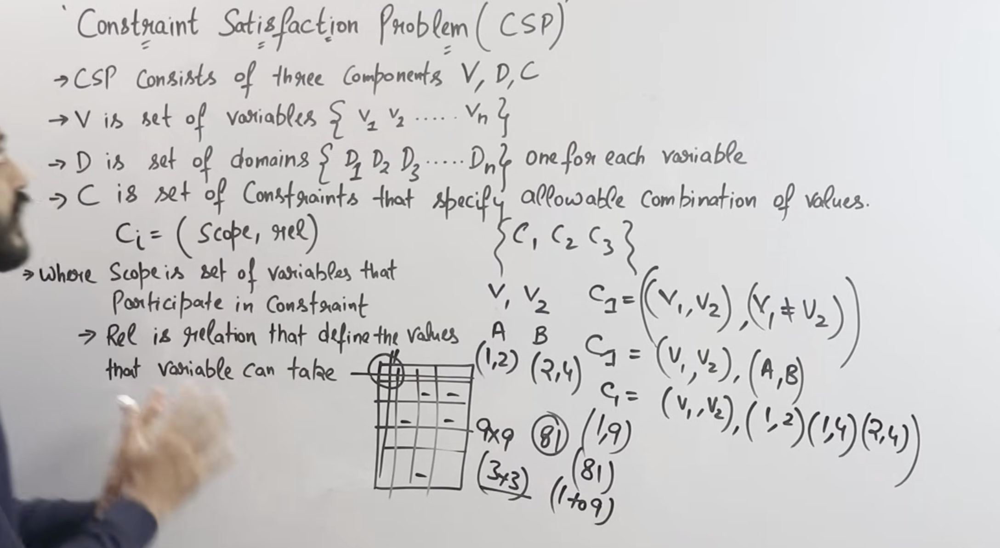
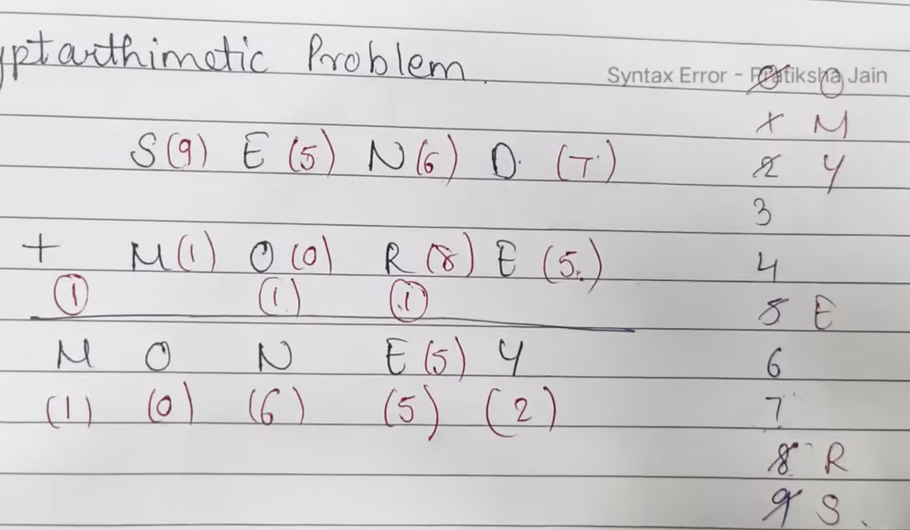
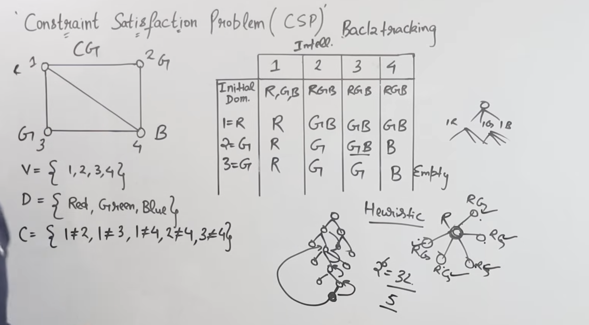

# 4. Constraint Satisfaction Problems

# 4.1 Defining CSPs

> **What is Constraint Propagation? Explain how the constraint satisfaction problems are resolved with a suitable example. (8) (Fall 2025)**
>
> **Define the Constraint Satisfaction Problems (CSPs)? What is the need of backtracking search for CSPs? Explain with a suitable example. (8) (Spring 2025)**
>
> **What is the purpose of constraint propagation? Explain the types of local consistency that are used for constraint propagation. (8) (Internal 2025)**
>
> **Write a short note on Constraint Propagation. (5) (Spring 2025)**

\*\*In standard search problems, states are treated as atomic (black boxes) — the algorithm has no knowledge of the internal structure of states. A **Constraint Satisfaction Problem (CSP)** uses a **factored representation** — the state is defined by a set of variables, each with a value, and the goal is specified as a set of constraints on those variables. This structure allows specialized algorithms that are far more efficient than generic search.

**Formal Definition — A CSP is defined by a triple (X, D, C):**

- **X = {X₁, X₂, ..., X_n}:** A set of **variables**.
- **D = {D₁, D₂, ..., D_n}:** A set of **domains**, where D_i is the set of allowable values for variable X_i.
- **C = {C₁, C₂, ..., C_m}:** A set of **constraints**, each specifying the allowable combinations of values for a subset of variables.

An **assignment** is a mapping of values to some or all variables. A **consistent assignment** violates no constraints. A **complete assignment** assigns a value to every variable. A **solution** is a complete, consistent assignment.

**Types of Variables:**

- **Discrete, Finite Domains:** Most common. Example: Boolean, colors, integers from a set. If there are n variables each with domain size d, there are d^n possible complete assignments.
- **Discrete, Infinite Domains:** Example: integers, strings. Constraints must be described using a constraint language (e.g., T₁ + 5 ≤ T₂) rather than enumeration.
- **Continuous Domains:** Example: real-valued variables in scheduling or engineering. Solved using linear programming or other optimization methods.

**Types of Constraints:**

- **Unary Constraints:** Restrict the value of a single variable. Example: SA ≠ Green. Can be handled by preprocessing (removing disallowed values from the domain).
- **Binary Constraints:** Relate two variables. Example: SA ≠ WA. The most common type, represented by a **constraint graph** where nodes are variables and edges are constraints.
- **Higher-Order (Global) Constraints:** Involve three or more variables. Example: AllDifferent(X₁, X₂, X₃) or X₁ + X₂ + X₃ = 10. Represented using a **constraint hypergraph**.

**Constraint Graph:** A graph where each node represents a variable and each edge represents a binary constraint between two variables. The structure of this graph determines how efficiently the CSP can be solved.

**\*\*Example — Map Coloring (Australia):**

- **Variables:** {WA, NT, SA, Q, NSW, V, T} (seven regions of Australia).
- **Domains:** {Red, Green, Blue} for each variable.
- **Constraints:** Adjacent regions must have different colors: WA ≠ NT, WA ≠ SA, NT ≠ SA, NT ≠ Q, SA ≠ Q, SA ≠ NSW, SA ≠ V, Q ≠ NSW, NSW ≠ V.

One solution: WA=Red, NT=Green, SA=Blue, Q=Red, NSW=Green, V=Red, T=Red.

**Other Classic CSP Examples:**

- **N-Queens Problem:** Place n queens on an n×n chessboard so that no two queens attack each other.
- **Sudoku:** Fill a 9×9 grid so that each row, column, and 3×3 box contains the digits 1–9 without repetition.
- **Cryptarithmetic:** Assign digits to letters such that an arithmetic equation holds (e.g., SEND + MORE = MONEY).
- **Job Scheduling:** Assign start times to tasks subject to precedence and resource constraints.

**\*\*Why CSP Formulation is Useful:**

- The factored representation allows generic CSP solvers to exploit structure.
- Constraint propagation can eliminate large portions of the search space before search begins.
- Domain-independent heuristics (MRV, LCV) work well across many CSP types.

---

# 4.2 Constraint Propagation

**Constraint propagation** is a technique that uses constraints to **reduce the domains of variables**, thereby pruning the search space before or during search. The idea is: if a value in a variable's domain cannot participate in any solution (because it violates a constraint with every possible value of a neighboring variable), that value can be removed.

**Purpose of Constraint Propagation:**

- Detect unsatisfiability early (before wasting time full searching).
- Reduce domain sizes, thereby reducing the branching factor.
- Can sometimes solve the problem entirely without search.
- When interleaved with search, dramatically improves efficiency.

## Types of Local Consistency

Local consistency make sure the choices look okay at a local level — checking small groups of variables.

**1. Node Consistency (1-Consistency):**

A variable X_i is **node-consistent** if every value in its domain D_i satisfies all **unary constraints** on X_i.

Enforcement is trivial: simply remove values from D_i that violate unary constraints.

Example: If X₁ ∈ {Red, Green, Blue} and the constraint says X₁ ≠ Green, then remove Green. D₁ becomes {Red, Blue}.

**2. Arc Consistency (2-Consistency):**

A variable X_i is **arc-consistent** with respect to variable X_j if for every value v in D_i, there exists at least one value w in D_j such that the constraint between X_i and X_j is satisfied. The pair (v, w) is called a **support**.

If a value in D_i has no support in D_j, it can be removed from D_i.

**3. Path Consistency (3-Consistency):**

A pair of variables {X_i, X_j} is **path-consistent** with respect to a third variable X_m if, for every assignment (X_i = a, X_j = b) that satisfies the constraint between X_i and X_j, there exists a value c in D_m such that (X_i = a, X_m = c) and (X_m = c, X_j = b) both satisfy their respective constraints.

Path consistency checks consistency over triples of variables and can detect inconsistencies that arc consistency misses.

**4. K-Consistency (Generalization):**

A CSP is **k-consistent** if for any set of k−1 variables with a consistent assignment, any k-th variable can be assigned a value consistent with all constraints involving those k variables.

**Trade-off:** Higher levels of consistency are more expensive to enforce but prune more of the search space. In practice, arc consistency (AC-3) provides the best cost-benefit trade-off for most problems.

---

# 4.3 Inference in CSPs

Inference in CSPs refers to using constraint propagation techniques during search to **detect failures early** and reduce the remaining search space. The key methods are:

**1. Forward Checking:**

When a variable X is assigned a value, forward checking examines every **unassigned** variable Y that is connected to X by a constraint. Any value in D_Y that is inconsistent with X's assignment is removed.

- If any variable's domain becomes empty, the current assignment is invalid — backtrack immediately.
- Forward checking detects failure earlier than simple backtracking (which only checks constraints when a variable is assigned).
- Limitation: Forward checking only looks one step ahead. It does not propagate the effects of domain reductions to other unassigned variables.

**2. Maintaining Arc Consistency (MAC):**

MAC is more powerful than forward checking. After every variable assignment, MAC runs the **AC-3 algorithm** starting from the arcs affected by the assignment. This propagates domain reductions through the entire constraint network, not just one step ahead.

- MAC detects failures that forward checking would miss.
- More expensive per step but reduces the search tree more aggressively.
- In practice, MAC is one of the most effective inference strategies for CSPs.

**Comparison:**

- **No inference:** Check constraints only when assigning. Detects failure late.
- **Forward checking:** Check constraints with unassigned neighbors. Detects failure one step ahead.
- **MAC (AC-3 during search):** Propagate constraint effects across the entire network. Detects failure earliest but costs more per assignment.

---

# 4.4 Backtracking Search for CSPs

**Why Backtracking Search is Needed:**

Constraint propagation alone may not solve the CSP — it can reduce domains and detect some inconsistencies, but for most problems, some form of search is still required. **Backtracking search** is the standard algorithm that combines systematic search with constraint propagation.

A naive approach would generate all possible complete assignments and check each one. For n variables with domain size d, this gives d^n assignments — computationally infeasible for large problems. Backtracking search avoids this by making assignments incrementally and pruning branches early rather than considering all permutations..

**Basic Backtracking Algorithm:**

1. Pick a variable that hasn't been assigned yet.
2. Try each of its possible values one by one.
3. If the value doesn't break any rule, assign it and try to solve the rest.
4. If the rest can't be solved, undo the assignment (backtrack) and try the next value.
5. If no value works, report failure.

The algorithm's speed depends on three key choices:

### Variable Ordering Heuristics (SELECT-UNASSIGNED-VARIABLE)

**1. Minimum Remaining Values (MRV) — "Fail-First" Heuristic:**

Select the variable with the **fewest legal values** remaining in its domain. The idea: if a variable has only one legal value, assign it immediately (forced choice). If it has zero, fail immediately. Choosing the most constrained variable first detects failures early, reducing the search tree.

**2. Degree Heuristic (Tie-Breaker):**

When multiple variables have the same MRV(minimum remaining values), select the one involved in the **most constraints with other unassigned variables**. This reduces the branching factor of future choices. The degree heuristic is most useful as a tie-breaker for MRV.

### Value Ordering Heuristic (ORDER-DOMAIN-VALUES)

**Least Constraining Value (LCV):**

Given a variable, try the value that **rules out the fewest values** in the domains of neighboring unassigned variables. This maximizes flexibility for future assignments, making it more likely to find a solution without backtracking.

Note: Variable ordering heuristics (MRV) try to fail fast; value ordering heuristics (LCV) try to succeed fast. They serve complementary purposes.

## Intelligent Backtracking

Standard backtracking goes back to the most recent variable when a failure occurs (chronological backtracking). This can be wasteful if the failure was caused by an earlier assignment.

**Conflict-Directed Backjumping:** Maintains a **conflict set** for each variable — the set of previously assigned variables that caused values to be deleted from its domain. When a failure occurs, the algorithm backtracks to the **most recent variable in the conflict set** rather than the immediately previous variable, skipping irrelevant variables.

