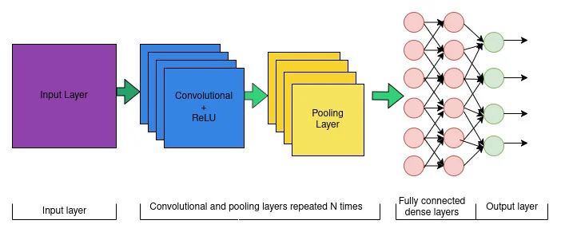
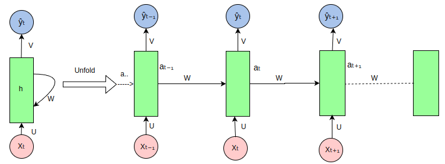
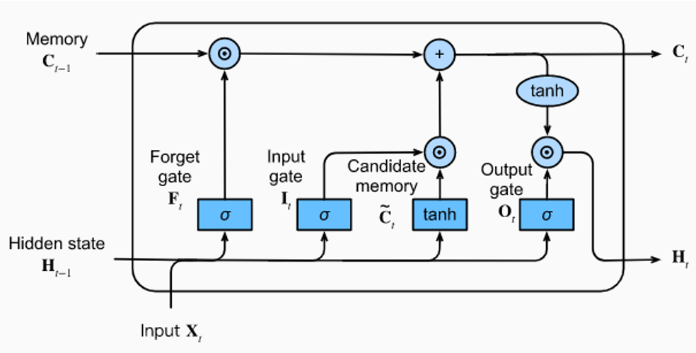
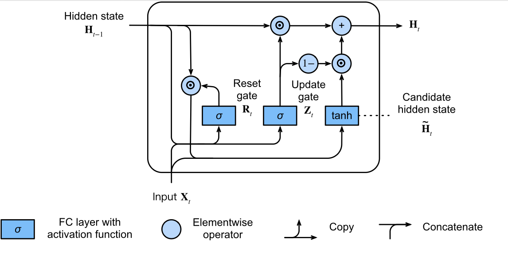
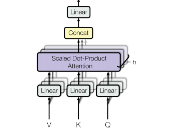
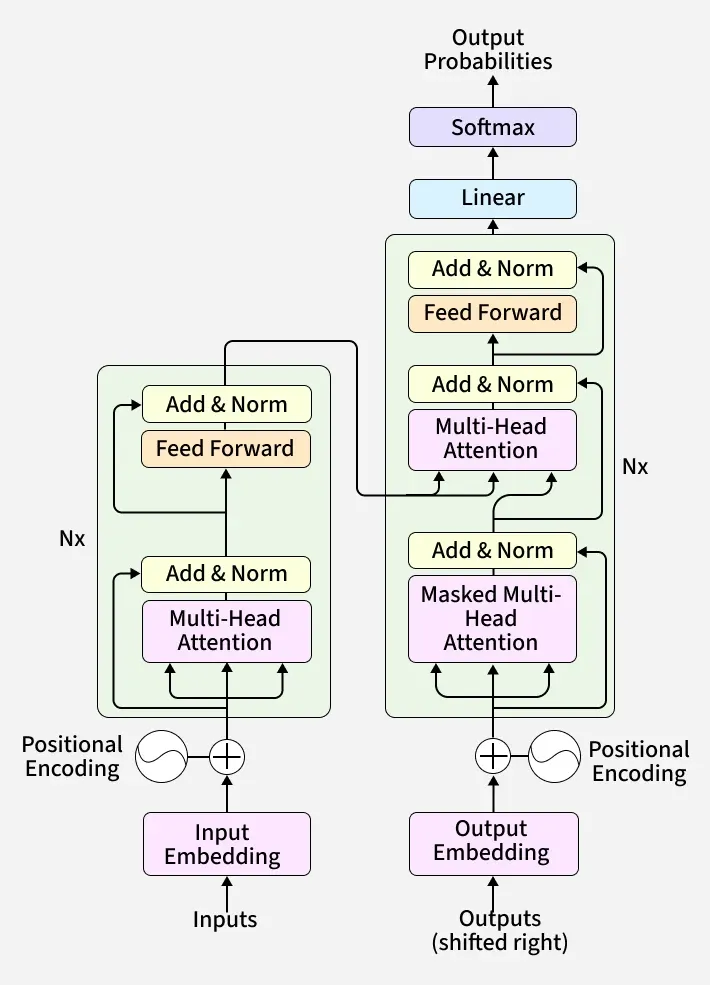

# 5. Neural Network and Deep Learning

# 5.1 Perceptron, Multi-Layer Perceptron (MLP) and Backpropagation

> **What do you understand by Artificial Neural Network? Design a neural network and explain how it works. (7) (Fall 2025)**
>
> **Explain the concept of a Multi-Layer Perceptron (MLP). Describe its architecture and working mechanism, including the roles of input, hidden, and output layers, as well as the process of forward propagation, activation functions and back-propagation. (7) (Spring 2025)**
>
> **Write a short note on Perceptron. (5) (Fall 2025)**

## Artificial Neural Network (ANN)

An **Artificial Neural Network** is a computational model inspired by the structure and functioning of biological neural networks in the brain. It consists of interconnected processing units (neurons) organized in layers that learn to map inputs to outputs by adjusting connection weights during training.

**Biological Inspiration:** A biological neuron receives signals through dendrites, processes them in the cell body, and transmits output through the axon. Similarly, an artificial neuron receives weighted inputs, applies an activation function, and produces an output.

## Perceptron (Single-Layer)

The **perceptron** (Frank Rosenblatt, 1958) is the simplest form of a neural network — a single artificial neuron that performs binary classification.

**Working:**

1. Receive inputs x₁, x₂, ..., x_n, each with a corresponding weight w₁, w₂, ..., w_n.
2. Compute the weighted sum: z = Σ(w_i × x_i) + b, where b is the bias.
3. Apply an activation function (step function): output = 1 if z ≥ 0, else output = 0.

**Learning Rule (Perceptron Update Rule):** For each misclassified sample: w_i ← w_i + α × (y − ŷ) × x_i, where α is the learning rate, y is the true label, and ŷ is the predicted output. The perceptron converges if the data is linearly separable.

**Limitation:** A single perceptron can only solve **linearly separable** problems. It cannot solve the XOR problem because XOR is not linearly separable. This limitation motivated the development of multi-layer networks.

## Multi-Layer Perceptron (MLP)

An MLP is a feedforward neural network with one or more **hidden layers** between the input and output layers. Each layer is fully connected to the next. MLPs can learn non-linear decision boundaries.

**Architecture:**

- **Input Layer:** Receives raw feature values. The number of neurons equals the number of input features. No computation is performed here.
- **Hidden Layer(s):** Intermediate layers that perform computations. Each neuron computes a weighted sum of inputs, adds a bias, and applies a non-linear activation function. Multiple hidden layers create a "deep" network.
- **Output Layer:** Produces the final prediction. For binary classification, typically 1 neuron with sigmoid activation. For multi-class classification, n neurons (one per class) with softmax activation. For regression, 1 neuron with linear activation.

## Activation Functions

Activation functions introduce **non-linearity** into the network. Without them, any number of layers would collapse into a single linear transformation.

- **Sigmoid:** σ(z) = 1 / (1 + e^(−z)). Output range: (0, 1). Used in output layers for binary classification. Problem: vanishing gradients for very large or small z.
- **Tanh:** tanh(z) = (e^z − e^(−z)) / (e^z + e^(−z)). Output range: (−1, 1). Zero-centered, which can help optimization. Still suffers from vanishing gradients.
- **ReLU (Rectified Linear Unit):** f(z) = max(0, z). Most popular for hidden layers. Computationally efficient. Mitigates vanishing gradient. Problem: "dying ReLU" — neurons can permanently output 0 if they enter the negative region.
- **Leaky ReLU:** f(z) = z if z > 0, else αz (small α like 0.01). Fixes the dying ReLU problem by allowing a small gradient for negative inputs.
- **Softmax:** Converts a vector of values into a probability distribution: softmax(z_i) = e^(z_i) / Σ e^(z_j). Used in the output layer for multi-class classification.

## Forward Propagation

Forward propagation computes the output of the network layer by layer:

1. For each neuron in layer l:
   $
   \boxed{z^{(l)}=W^{(l)}a^{(l-1)}+b^{(l)}}
   $
   , then
   $
   \boxed{a^{(l)}=f\left(z^{(l)}\right)}
   $

, where $W^{(l)}$ is the weight matrix, $b^{(l)}$ is the bias vector, $a^{(l−1)}$ is the activation from the previous layer, and f is the activation function.

2. The process starts from the input layer ($a^{(0)} = x$) and propagates through all hidden layers to produce the output $\hat{y} = a^{(L)}$.

## Loss Functions

The loss function measures how far the predicted output is from the true output:

- **Mean Squared Error (MSE):** $L = \frac{1}{n}\sum (y_i - \hat{y}_i)^2$ — used for regression.
- **Binary Cross-Entropy:** $L = -\frac{1}{n}\sum [y_i\log(\hat{y}_i) + (1-y_i)\log(1-\hat{y}_i)]$ — used for binary classification.
- **Categorical Cross-Entropy:** $L = -\sum y_i\log(\hat{y}_i)$ — used for multi-class classification.

## Backpropagation

**Backpropagation** is how the neural network actually learns. After making a prediction (forward propagation), the network checks how wrong it was (using the loss function) and then goes **backward** through the layers to adjust the weights so that next time, the prediction will be better.

**How it works (step by step):**

1. Do forward propagation and calculate the loss (error).
2. Start from the output layer and calculate how much each weight contributed to the error.
3. Move backward through each layer, calculating the same thing for every weight. This uses a math technique called the **chain rule** — it's like figuring out how a small change in one weight at the beginning affects the final error at the end.
4. Adjust all the weights slightly to reduce the error: new weight = old weight − learning rate × gradient.

The **learning rate** controls how big the adjustment steps are. Too big and you might overshoot; too small and learning will be very slow.

**Optimizers (Ways to adjust weights):**

- **SGD (Stochastic Gradient Descent):** Updates weights after looking at each single example. It's fast but can be jumpy/noisy.
- **Mini-batch SGD:** Updates weights after looking at a small group of examples. A good balance between speed and stability.
- **Adam:** A smart optimizer that adjusts the learning rate automatically for each weight. It's the most popular choice today because it works well in most cases.

---

# 5.2 Convolutional Neural Networks (CNN)

> **What is a Neural Network? Explain the working mechanism of a CNN with suitable example. (8) (Internal 2025)**
>
> **Define CNN. (Spring 2025)**

A **Convolutional Neural Network** is a specialized deep learning architecture designed primarily for processing **grid-structured data** such as images. CNNs exploit spatial locality and translational invariance through parameter sharing and local connectivity. Just like our eyes recognize objects by looking at small parts (edges, shapes, colors) and combining them, a CNN does the same thing — it looks at small pieces of an image and builds up understanding step by step.

**Key Architectural Components:**

**1. Convolutional Layer:** The core building block. A set of learnable **filters (kernels)** — small matrices (e.g., 3×3, 5×5) — slide (convolve) over the input to produce **feature maps**. Each filter detects a specific feature (edges, textures, patterns). At each position, the filter multiplies its values with the image pixels underneath and adds them up to get one number. This creates a new, smaller image called a feature map.

Different filters detect different things — one might detect horizontal edges, another might detect vertical edges, another might detect curves, etc.

- **Stride:** The step size by which the filter moves. Stride=1 moves one pixel at a time; stride=2 skips every other pixel, reducing spatial dimensions.
- **Padding:** Adding extra zeros around the edges of the image so the filter can process border pixels properly.

**2. Pooling Layer:** Reduces the spatial dimensions of feature maps (downsampling), decreasing computation and providing spatial invariance.

- **Max Pooling:** Takes the maximum value from each patch (e.g., 2×2 region). Most commonly used.
- **Average Pooling:** Takes the average value from each patch.

**3. Activation (ReLU):** Applied after each convolution to introduce non-linearity: f(x) = max(0, x).

**4. Fully Connected (Dense) Layer:** After several convolutional and pooling layers, the feature maps are **flattened** into a 1D vector and fed into one or more fully connected layers for final classification or regression.

**Working Mechanism — Image Classification Example:**

Input: 32×32×3 color image (e.g., classifying handwritten digits).

1. **Conv Layer 1:** Apply 32 filters of size 5×5 → 32 feature maps of size 28×28. Apply ReLU.
2. **Pooling Layer 1:** Max pooling with 2×2 → size reduced to 14×14.
3. **Conv Layer 2:** Apply 64 filters of size 5×5 → 64 feature maps of size 10×10. Apply ReLU.
4. **Pooling Layer 2:** Max pooling with 2×2 → size reduced to 5×5.
5. **Flatten:** 64 × 5 × 5 = 1600-dimensional vector.
6. **FC Layer:** 1600 → 128 neurons with ReLU.
7. **Output Layer:** 128 → 10 neurons with softmax (for 10 digit classes).

Training uses backpropagation with cross-entropy loss.

**Notable CNN Architectures:** LeNet-5 (1998), AlexNet (2012), VGGNet, GoogLeNet/Inception, ResNet (2015, introduced skip connections).

## Zero-Shot and Few-Shot Learning

**Zero-Shot Learning:** The model classifies categories it has **never seen** during training. It relies on auxiliary information (semantic attributes, text descriptions, embeddings) to bridge seen and unseen classes. Example: a model trained on images of cats and dogs can classify a horse if given a semantic description relating horses to the training classes.

**Few-Shot Learning:** The model learns to classify new categories from only a **very small number of examples** (1–5 samples per class). Approaches include:

- **Metric Learning:** Learn a similarity function (e.g., Siamese networks) that compares new examples to the few labeled ones. Teaching the model to compare new images with the few examples and find which one is most similar (like matching pictures).
- **Meta-Learning ("Learning to Learn"):** Train the model on many small tasks so it can quickly adapt to new tasks with minimal data (e.g., MAML — Model-Agnostic Meta-Learning).

## Graph Convolutional Networks (Graph CNN)

Standard CNNs work on regular grids (images). **Graph CNNs** extend convolution operations to **graph-structured data** (nodes and edges) where the topology is irregular.

**Working:** Each node updates its feature representation by aggregating features from its neighboring nodes, in a GCN layer. This way, each node learns not just about itself, but also about its surroundings. Imagine a social network — each person is a node, and their friends are neighbors. A GCN would learn about a person by looking at their friends' profiles too.

<!-- h*v^(l+1) = σ(Σ*{u ∈ N(v)} (1/c\_{vu}) W^(l) h_u^(l))

where h*v is the feature of node v, N(v) is its neighbors, c*{vu} is a normalization factor, W is a learnable weight matrix, and σ is an activation function. -->

**Applications:** Social network analysis, molecular property prediction, recommendation systems, traffic forecasting.

---

# 5.3 Recurrent Neural Networks (RNN)

> **What are the challenges of RNNs? Discuss about the architecture to solve these challenges. (7) (Fall 2025)**
>
> **Explain the working mechanism of RNN with a suitable example. (8) (Spring 2025)**
>
> **Write a short note on RNN. (5) (Internal 2025)**

A **Recurrent Neural Network** is a neural network designed for processing **sequential data** (time series, text, speech) where the order of inputs matters. Unlike feedforward networks, RNNs have **recurrent connections** — the output at each time step is fed back as input to the next step, giving the network a form of memory.

**How it works:**

At each time step t:

1. The RNN takes the current input (x_t) — for example, the current word in a sentence.
2. It also takes the **hidden state** from the previous step (h\_{t−1}) — this is the "memory" of what it has seen so far.
3. It combines both using weights, adds a bias, and applies the tanh activation function to produce a new hidden state (h_t).
4. This hidden state can be used to make a prediction (output) and is also passed to the next time step.

The same set of weights is used at every time step — this is called **parameter sharing**.

**Training:** RNNs are trained using **Backpropagation Through Time (BPTT)** — the network is "unrolled" across all time steps, and then regular backpropagation is applied.

**Example — Next Word Prediction:** Given the sentence "The cat sat on the \_\_\_", at each time step, the RNN processes one word, updates its hidden state (accumulating context), and at the final step, predicts the next word from the vocabulary using softmax.

- Step 1: RNN reads "The" → updates memory.
- Step 2: RNN reads "cat" → updates memory (now remembers "The cat").
- Step 3: RNN reads "sat" → updates memory.
- Step 4: RNN reads "on" → updates memory.
- Step 5: RNN reads "the" → uses all the accumulated memory to predict the next word, like "mat" or "floor".

**Problems with RNNs:**

1. **Vanishing Gradient Problem:** During BPTT, gradients are multiplied by the weight matrix at each time step. If the weights are small (eigenvalues < 1), gradients shrink exponentially, making it impossible to learn long-range dependencies. The error signal becomes weaker and weaker as it travels backward through time. The network "forgets" information from early time steps.
2. **Exploding Gradient Problem:** If weights are large (eigenvalues > 1), gradients grow exponentially, making training unstable. This is fixed by **gradient clipping** (putting a cap on how large the gradients can be).
3. **Hard to remember long sequences:** Standard RNNs can only effectively remember about 10–20 steps back.
4. **Sequential Processing:** RNNs process time steps one by one, preventing parallelization and making training slow on long sequences.

## LSTM (Long Short-Term Memory)

**LSTM** (Hochreiter & Schmidhuber, 1997) solves the vanishing gradient problem by introducing a **cell state** (a highway for information flow) and three **gating mechanisms** that control what information is stored, forgotten, and output.

**Gates (all use sigmoid activation, outputting values in [0, 1]):**

**The Three Gates:**

**1. Forget Gate — "What should I forget?"**
It looks at the previous output and the current input, and decides what old information to throw away from the cell state. It outputs a number between 0 (forget everything) and 1 (keep everything) for each piece of information.

**2. Input Gate — "What new information should I add?"**
It decides what new information from the current input is worth storing in the cell state.

**3. Output Gate — "What should I output?"**
It decides what part of the cell state to use as the output for this step.

**Why is LSTM better?** The cell state acts like a highway — information can flow through it easily across many time steps. This means the network can remember important information from the beginning of a very long sequence.

## GRU (Gated Recurrent Unit)

**GRU** (Cho et al., 2014) is a simplified variant of LSTM with **two gates** instead of three, merging the cell state and hidden state into a single state.

**Gates:**

**1. Update Gate — "How much old info to keep vs. how much new info to add?"**
It combines the job of LSTM's forget gate and input gate into one gate.

**2. Reset Gate — "How much of the old info to ignore when computing new info?"**
It controls how much of the previous memory (state) to use when calculating the new candidate state.

GRUs have fewer parameters than LSTMs and train faster, while achieving comparable performance on many tasks.

---

# 5.4 Attention Mechanisms

> **What is the attention mechanism used in transformers? (Spring 2025)**

In standard sequence-to-sequence models (encoder-decoder RNNs), the entire input sequence is compressed into a single fixed-length context vector. This creates a **bottleneck** — for long sequences, the fixed vector cannot capture all relevant information, and performance degrades.

**Attention** (Bahdanau et al., 2015) solves this by allowing the decoder to **look at all encoder hidden states** and focus on the most relevant parts of the input for each output step.

**How Attention Works (step by step):**

1. The encoder (input processor) creates a summary for each input word — these are called hidden states (h₁, h₂, ...).
2. When generating each output word, the decoder asks: "Which input words are most important right now?"
3. It calculates an **attention score** for each input word — higher score means more relevant.
4. These scores are converted to **attention weights** (numbers between 0 and 1 that add up to 1) using softmax.
5. A **context vector** is created by taking a weighted average of all input summaries (words with higher weights contribute more).
6. This context vector is used along with the decoder's own state to generate the next output word.

**Example:** When translating "The cat is black" to Nepali, while generating the word for "cat", the attention mechanism would focus most on the word "cat" in the input.

## Self-Attention (Scaled Dot-Product Attention)

**Self-attention** is when a sequence pays attention to **itself**. Each word in a sentence looks at every other word in the **same** sentence to understand context. This helps capture relationships between words regardless of how far apart they are.

For each word/token, three vectors are created:

- **Query (Q):** What this word/token is looking for.
- **Key (K):** What this word/token can offer to others.
- **Value (V):** The actual information content of this word/token.

**Example:** In "The animal didn't cross the street because **it** was too tired" — self-attention helps the model understand that "it" refers to "animal" (not "street") by assigning a high attention weight between "it" and "animal".

## Multi-Head Attention

Instead of doing attention just once, multi-head attention runs attention functions (heads) multiple times in parallel with different learned perspectives. Each "head" can focus on different types of relationships — one might focus on grammar, another on meaning, another on position.

The results from all heads are combined together, giving a much richer understanding than a single attention computation.

---

# 5.5 Transformers

> **Explain the transformer model architecture. (8) (Fall 2025)**
>
> **Describe transformer with its architectures. (Internal 2025)**

The Transformer was introduced in 2017 in the famous paper "Attention Is All You Need." It's a revolutionary architecture that relies entirely on attention — no RNNs, no CNNs. It processes all positions/words in parallel, enabling much faster training and superior performance on sequence tasks.

**Architecture — Encoder-Decoder:**

## Encoder

The encoder reads the entire input and creates a deep understanding of it. The encoder consists of a stack of N identical layers (N=6 in the original paper). Each layer has two sub-layers:

1. **Multi-Head Self-Attention:** Each position attends to all positions in the input. Captures contextual relationships.
2. **Position-wise Feed-Forward Network:** Two linear transformations with a ReLU activation. Applied independently to each position.

Each of these parts also has:

- **Residual Connection:** A shortcut that adds the input of a layer directly to its output (like a skip road). This helps the network train better by letting information flow easily.
- **Layer Normalization:** A technique that keeps the numbers in a stable range, preventing training problems.

## Decoder

The decoder generates the output one word at a time. The decoder also consists of N identical layers, each with three sub-layers:

1. **Masked Multi-Head Self-Attention:** Same as encoder self-attention but with masking — each position can only attend to previous positions (and itself), preventing information from future tokens from leaking during generation.
2. **Encoder-Decoder Attention:** The decoder looks at the encoder's output to understand the input. Queries come from the decoder, but keys and values come from the encoder.
3. **Position-wise Feed-Forward Network:** Same as in the encoder.

## Positional Encoding

Since the Transformer processes all words at the same time (not one by one like RNNs), it doesn't naturally know the **order** of words. "The cat sat on the mat" and "mat the on sat cat the" would look the same! To fix this, **positional encodings** — special numbers representing each word's position — are added to the word representations before feeding them into the model.

**Advantages of Transformers over RNNs:**

- **Parallel Processing:** All positions are processed simultaneously, unlike RNNs which process sequentially.
- **Better at long-range connections:** Any two words can directly attend to each other, no matter how far apart. In RNNs, distant words had to pass through many steps.
- **Scalable:** Can handle bigger datasets and longer sequences.

**Types of Transformer Models:**

- **Encoder-only (e.g., BERT):** Good at understanding text (classification, question answering).
- **Decoder-only (e.g., GPT):** Good at generating text (writing stories, chatbots).
- **Encoder-Decoder (e.g., T5, original Transformer):** Good at converting one sequence to another (translation, summarization).

## BERT (Bidirectional Encoder Representations from Transformers)

BERT (Devlin et al., 2019) uses the **encoder** portion of the Transformer. It reads the entire input sequence **bidirectionally** — every token attends to every other token in both directions simultaneously.

**Pre-training objectives: (How is BERT trained?)**

- **Masked Language Model (MLM):** Randomly mask 15% of tokens and train the model to predict them from context. This forces it to understand context from both directions.
- **Next Sentence Prediction (NSP):** Given two sentences, predict whether the second sentence follows the first in the original text. This helps it understand relationships between sentences.

After this pre-training on huge amounts of text, BERT can be fine-tuned (slightly adjusted) for specific tasks like sentiment analysis, question answering, etc by adding a task-specific output layer.

## GPT (Generative Pre-trained Transformer)

GPT uses the **decoder** portion of the Transformer. It reads the input **left-to-right** (unidirectional/autoregressive) — each token can only attend to tokens before it.

**Pre-training objective:** Next-token prediction — predict the next token given all previous tokens. This autoregressive approach is ideal for text generation. For example: "The cat sat on the" → predict "mat".

GPT models (GPT-2, GPT-3, GPT-4) scale by increasing model size, data, and compute, demonstrating emergent abilities with scale at writing, reasoning, and answering questions.

---

# 5.6 Graph Attention Networks (GAT)

**Graph Attention Networks (GATs)** (2018) apply the attention mechanism to **graph-shaped data** (data with nodes and connections, like social networks or molecular structures).

**The problem with regular Graph CNNs:** In Graph CNNs, every neighbor of a node is treated equally or weighted based on the graph structure (how many connections each node has). But in reality, some neighbors are more important than others!

**How GATs solve this:** GATs **learn** how important each neighbor is. They use attention to give different weights to different neighbors — important neighbors get more attention, less important ones get less.

**How a GAT layer works:**

1. **Transform:** Each node's features are transformed using a weight matrix.
2. **Score:** For each pair of connected nodes, calculate an attention score (how relevant is this neighbor?).
3. **Normalize:** Use softmax to convert scores into weights that add up to 1.
4. **Aggregate:** Each node creates its new representation by taking a weighted combination of its neighbors' features.
5. **Multi-Head:** This is done multiple times with different attention heads for stability and richer learning.

**Advantages over GCNs:**

- **Adaptive weighting:** Different neighbors get different importance weights rather than uniform or degree-based weights.
- **Inductive capability:** Can generalize to unseen graph structures because attention weights depend on features, not fixed graph topology.
- **Interpretability:** Attention weights reveal which neighbors are most influential for each node's prediction.

**Uses:** Classifying nodes in networks, analyzing social media, predicting drug interactions, completing knowledge graphs.

---

# 5.7 Transfer Learning

> **What is the purpose of Transfer Learning? Differentiate between a Tokenizer and an Embedding. Justify which one is more suitable for machine learning procedures. (7) (Internal 2025)**
>
> **Write a short note on Transfer Learning. (5) (Fall 2025, Spring 2025)**

**Transfer Learning** is a technique where a model trained on one (usually large) task or dataset is **reused as the starting point** for a different but related task. Instead of training from scratch, the knowledge (learned features, weights, representations) from the source task is transferred to accelerate learning on the target task.

**Purpose:**

- **Reduces data requirements:** Enables training with limited labeled data for the target task.
- **Reduces training time:** Pre-trained weights provide a strong initialization, converging faster.
- **Improves performance:** Pre-trained models have learned general features (edges, textures in images; syntax, semantics in text) that transfer well to many tasks.

**Two Main Strategies:**

**1. Feature Extraction:** Take a pre-trained model, freeze it (don't change its weights), and use it as a feature extractor. Just add a new small layer at the end for your specific task and train only that new layer. Best when: you have very little data for your new task.

**2. Fine-Tuning:** Unfreeze some or all pre-trained layers and retrain them with a **low learning rate** on the target dataset. The early layers (which learn general features) are often kept frozen, while later layers (which learn task-specific features) are fine-tuned. Best when: the target dataset is moderately large or differs significantly from the source.

**Examples:**

- **Computer Vision:** Take a model trained on millions of general images (like ImageNet), then fine-tune it to recognize medical X-rays — even if you only have a few thousand X-ray images.
- **NLP:** Take BERT or GPT (pre-trained on massive amounts of text), then fine-tune it for sentiment analysis or question answering with a small dataset.

## Tokenizer vs. Embedding

**Tokenizer:** A **preprocessing tool** that converts raw text into discrete tokens (units). It breaks text into words, subwords, or characters and maps each to an integer ID from a vocabulary. The tokenizer is a rule-based or trained algorithm — it does **not** capture semantic meaning.

- Types: Word-level (split by spaces), Subword-level ("un" + "happi" + "ness"), Character-level.
- Output: A sequence of integer IDs. Example: "I love AI" → ["I", "love", "AI"] → [45, 312, 89].

**Embedding:** A **learned dense vector representation** of each token. It maps each token ID to a continuous vector in a high-dimensional space where semantically similar tokens are closer together. Embeddings capture meaning, relationships, and context.

- Output: A matrix of real-valued vectors. Example: token ID 312 → [0.12, −0.34, 0.56, ...] (d-dimensional).

**Tokenizer vs. Embedding — Key Differences:**

- **Function:** Tokenizer = text → integer IDs (preprocessing). Embedding = integer IDs → dense vectors (representation learning).
- **Semantic Understanding:** Tokenizer has no semantic knowledge. Embedding captures semantic meaning.
- **Learnability:** Tokenizer is typically fixed (rule-based or pre-trained). Embedding weights are learned during model training.
- **Order in Pipeline:** Tokenization happens first; embedding happens second.

**Which is more suitable for ML?** Embeddings are more suitable for machine learning because they give words a meaningful numerical representation that the model can actually learn from. A tokenizer is just a necessary first step (like chopping vegetables before cooking) — it doesn't contribute to learning itself. The real power of modern language models comes from their embeddings, which capture rich information about word meanings and relationships.
